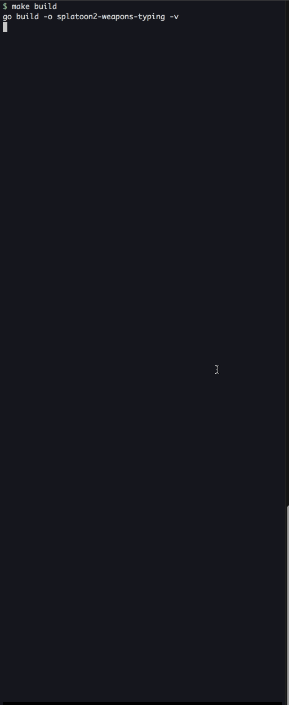

# splatoon2-weapons-typing

## Overview

This is a typing game that types weapon names of Splatoon2.

The time limit is 15 seconds. (You can also change it to 30 seconds by specifying `--timeout=30` etc.)

When tye type matches, "Splatted {weapon name}!" is displayed in the colored balloon.

At the end of the game, the following score will be displayed.

- Total number of hits
- Hits per second
- Number of hits per character

## How to try

```shell
$ make build
$ ./splatoon2-weapons-typing
```

## How to run the test

```shell
$ make test
```

## How to read GoDoc

```shell
$ make doc
```

## How to see code coverage

```shell
$ make cov
```

## How to specify the options

| Option                   | Description                                                                                         |
| ---                      | ---                                                                                                 |
| `--timeout=15`           | Time limit in this typing game (default 15)                                                         |
| `--path="./weapons.txt"` | File path in which a list of words used for this typing game is described (default "./weapons.txt") |

## Demo


